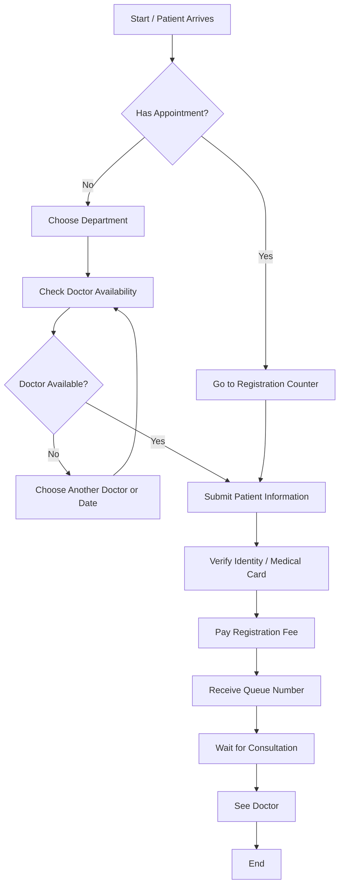

# Hospital Registration Process

```mermaid
flowchart TD
    A[Start / Patient Arrives] --> B{Has Appointment?}

    B -- Yes --> C[Go to Registration Counter]
    B -- No --> D[Choose Department]

    D --> E[Check Doctor Availability]
    E --> F{Doctor Available?}

    F -- No --> G[Choose Another Doctor or Date]
    G --> E

    F -- Yes --> H[Submit Patient Information]
    C --> H

    H --> I[Verify Identity / Medical Card]
    I --> J[Pay Registration Fee]
    J --> K[Receive Queue Number]
    K --> L[Wait for Consultation]
    L --> M[See Doctor]
    M --> N[End]
```
